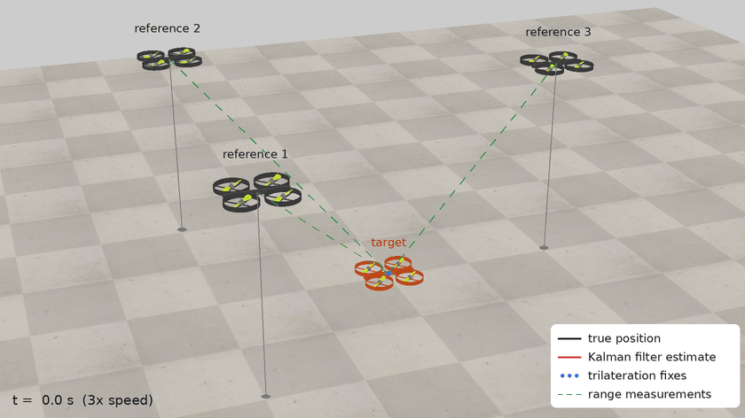
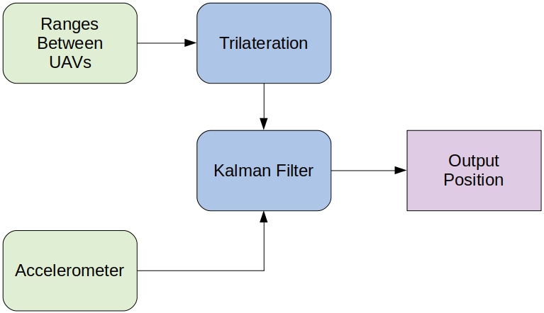
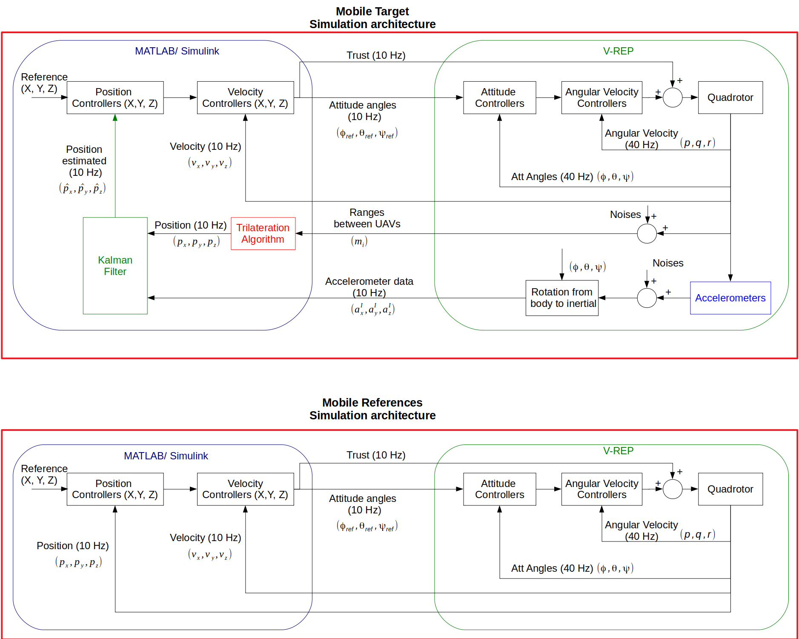
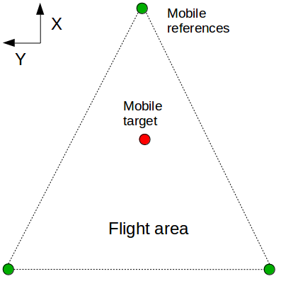
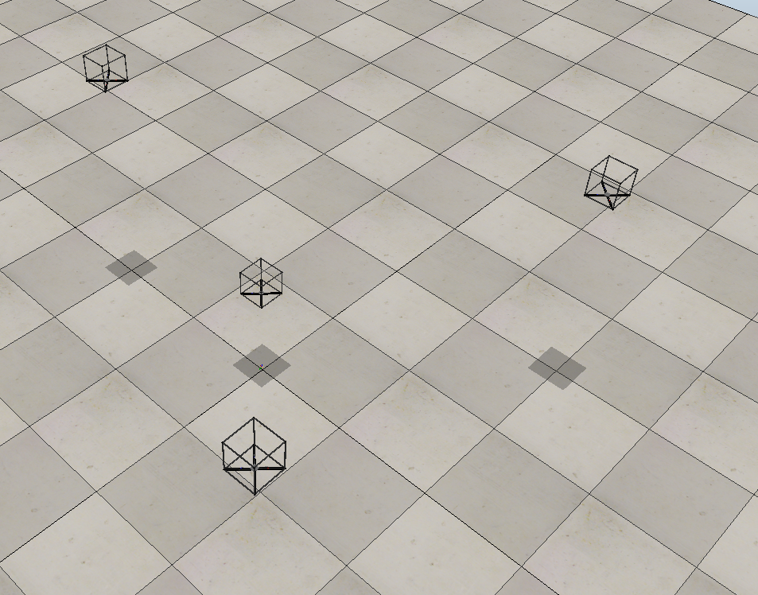
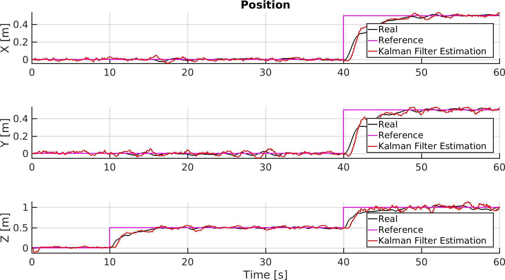
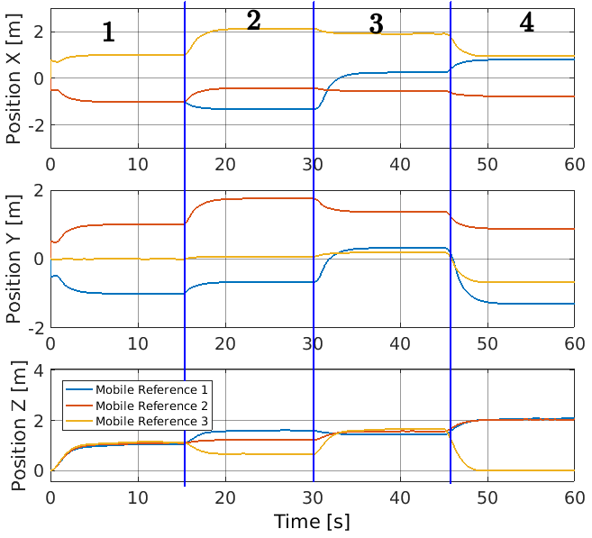
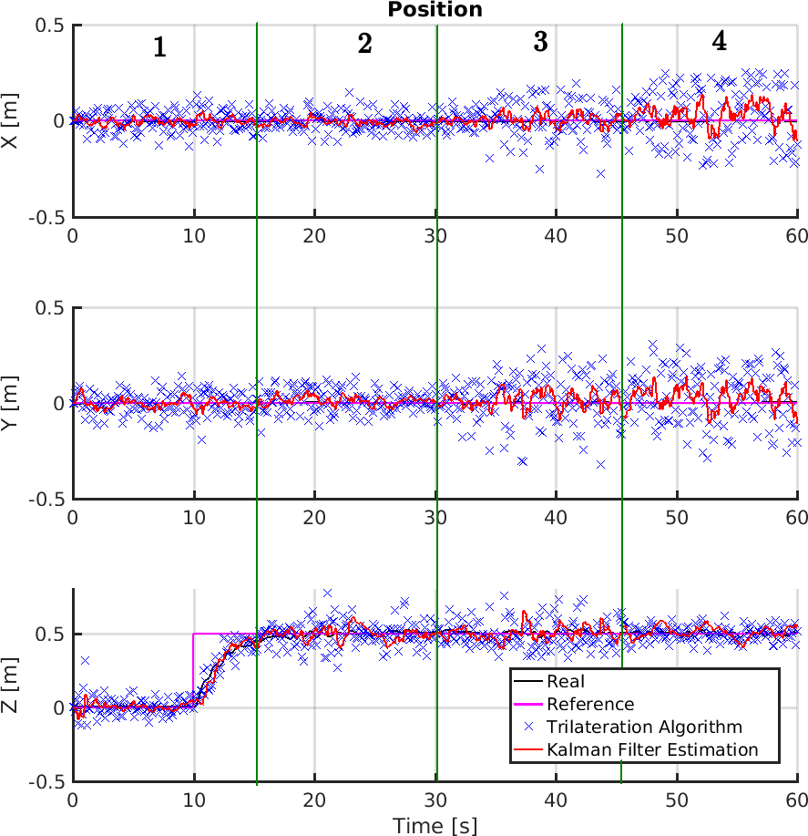

# CooperativeLocalizationUAVs

> **Note:** All code in this repository was written by Kleber Cabral. The README documentation and inline code comments were added with AI assistance (Claude).

Cooperative localization of a quadrotor using range measurements to other UAVs, fused
with accelerometer data in a Kalman filter. Simulated with MATLAB/Simulink and V-REP.

This was the final project for **EE523 – Inertial Navigation Systems** (Project 3,
December 2018).

📄 **Main document: [Project 3 report (PDF)](docs/EE523_Project3_Report.pdf)**

It extends the range-based localization idea of the
[ALOS acoustic localization system](https://doi.org/10.1109/ICCSPA.2019.8713689)
(ICCSPA 2019). Here the fixed beacons are replaced by other flying quadrotors.

<p align="center">
  
</p>

*Scenario 1 replayed in CoppeliaSim from the saved simulation results (`results/quadrotor3_var_PT1.mat`): the references hover at the positions of the report's table 4.2 while the target ascends, hovers and translates. The vehicles are placed from the logged data and drawn with CoppeliaSim's stock quadcopter model; the paths, fixes and range lines are overlaid on the camera image.*

## What it does

A group of quadrotors flies together. Three *mobile references* know their own position
accurately. The *mobile target* doesn't: it estimates its position from its distances to
the references, like a GPS receiver with the other UAVs acting as the satellites.

<p align="center">
  
</p>

- **Trilateration:** a Taylor-series (linearized least-squares) algorithm turns the
  ranges to the references into a position fix (`src/taylor_series.m`,
  `src/LocationAlgorithm.m`).
- **Kalman filter:** the prediction step integrates the target's accelerometer through
  a kinematic model (acceleration → velocity → position). The update step uses the
  trilateration fix as the measurement (`src/Kalman2D.m`).
- **Simulation:** Simulink runs the position/velocity controllers, the sensor models
  (Gaussian noise on the accelerometer and on the ranges) and the estimator. V-REP
  simulates the quadrotor dynamics and attitude control. The two are synchronized
  through V-REP's remote API (`src/vrep_comm.m`).

<p align="center">
  
</p>

<p align="center">
  
  &nbsp;
  
</p>

## Results

The report covers four flight scenarios:

1. The target ascends, hovers and translates inside the triangle formed by the references.
2. The references move, then all vehicles move together.
3. "Bad geometry": the target flies outside the reference triangle, and the references
   are rearranged.
4. Scenario 1 repeated with a fourth measurement from a height sensor.

The trilateration fixes are noisy (blue), but the Kalman filter estimate (red) tracks
the true position (black) closely. In scenario 1 the filter's RMSE is about 2–5 cm per axis.

<p align="center">
  
</p>

As expected, trilateration degrades when the reference geometry is poor (scenario 3).
The filtered estimate holds up much better:

<p align="center">
  
  
</p>

| RMSE, whole flight (scenario 1 vs 4) | X [m] | Y [m] | Z [m] |
|---|---|---|---|
| Trilateration, 3 measurements | 0.0250 | 0.0349 | 0.0669 |
| Trilateration, 4 measurements | 0.0376 | 0.0536 | 0.0423 |
| Kalman filter, 3 measurements | 0.0223 | 0.0306 | 0.0448 |
| Kalman filter, 4 measurements | 0.0254 | 0.0387 | 0.0493 |

See the [report](docs/EE523_Project3_Report.pdf) for the full derivation, all scenarios
and the discussion.

## Structure

```
CooperativeLocalizationUAVs/
├── docs/EE523_Project3_Report.pdf          # the project report (main document)
├── src/
│   ├── quad_sim_mult_UAVs_coop_localization.slx   # Simulink model (controllers, sensors, estimator)
│   ├── multiple_UAVs_coop_localization.ttt        # V-REP scene (four quadrotors)
│   ├── setup_gains.m          # controller gains, start/end positions, noise seeds (model InitFcn)
│   ├── kalman_variables.mat   # filter matrices + P history saved by Kalman2D at the end of a run
│   ├── Kalman2D.m             # S-function: Kalman filter
│   ├── LocationAlgorithm.m    # S-function: trilateration from 3 or 4 ranges
│   ├── taylor_series.m        # Taylor-series trilateration solver
│   ├── kalman_filter.m        # Kalman filter init/propagate/update helper
│   ├── vrep_comm.m            # S-function: synchronous link to V-REP (remote API)
│   └── plot_figures_report.m  # regenerates the report's result figures
├── results/quadrotor3_var_PT*.mat          # logged simulation runs, one per scenario/part
└── figures/                                # report figures (.png, MATLAB .fig, .odg diagram sources)
```

## Install

- MATLAB + Simulink (developed on R2018-era MATLAB on Windows).
- V-REP (now CoppeliaSim) with its legacy remote API. Copy `remApi.m`,
  `remoteApiProto.m` and the `remoteApi` library (`.dll`/`.so`/`.dylib`) from the
  V-REP install (`programming/remoteApiBindings/`) into `src/`. They're V-REP's files,
  so they aren't included here.

## Run

1. Open `src/multiple_UAVs_coop_localization.ttt` in V-REP. The model connects to V-REP's
   default remote API server on port 19997.
2. In MATLAB, `cd src`. `setup_gains` runs automatically as the model's `InitFcn`.
3. Set the V-REP address in `vrep_comm.m` (`simxStart`). It is currently set to a
   VM address (`192.168.56.101`); use `127.0.0.1` if V-REP runs on the same machine.
4. Open and run `quad_sim_mult_UAVs_coop_localization.slx`.

To redo the report plots from the logged runs: `addpath src; cd results;
plot_figures_report`. Uncomment the section for the scenario you want.

## Key dependencies

MATLAB, Simulink, V-REP/CoppeliaSim (legacy remote API).

## Status

Course project, complete (December 2018). Simplifications noted in the report: the
mobile references have ideal position information, and attitude errors aren't
modeled.

## Cleanup notes

- **2026-10-02:** Published from the original project folder. Left out: the compiled
  Simulink build (`*.mexw64`, `slprj/`), V-REP's remote API files, the abstract drafts and
  an early LaTeX draft of the report. Also left out a plotting script (`print_results.m`)
  that belonged to a different project and loaded a file that isn't here. The report
  PDF's metadata was set to the title and author.

## License

MIT — see [LICENSE](LICENSE).
